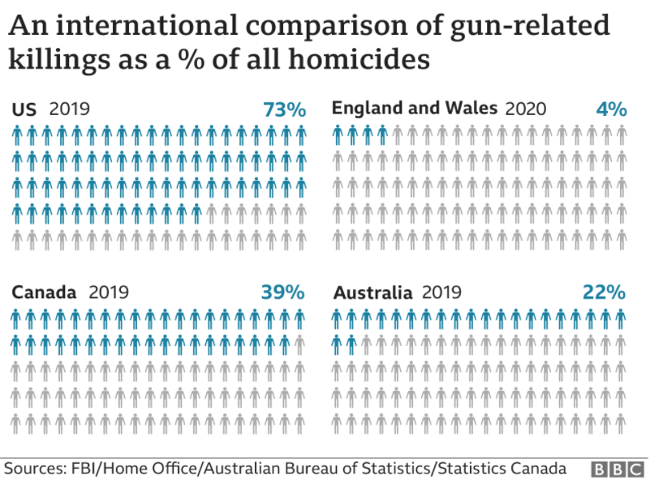
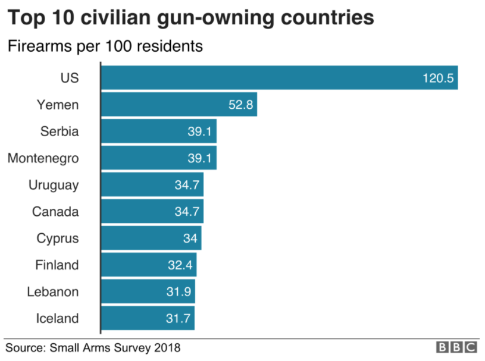

class: left

# Guns and violence in the U.S.

.center[
```{r, echo=F,  out.width="70%"}

```
]

.footnote[
[1] Retrieved from [America's gun culture in charts](https://www.bbc.com/news/world-us-canada-41488081)
]

```{r xaringanExtra-freezeframe, echo=FALSE}
xaringanExtra::use_freezeframe()
xaringanExtra::use_webcam()
```


---

# Guns and violence in the U.S.

.center[
```{r, echo=F,  out.width="70%"}

```
]

.footnote[
[1] Retrieved from [America's gun culture in charts](https://www.bbc.com/news/world-us-canada-41488081)
]

---

class: left
# Literature: Lott & Mustard

.pull-left[

]

--

.pull-right[

]

???

John Lott & David Mustardp

---

background-image: url("https://media.giphy.com/media/1etWs6HIlQM3Q0CDbt/giphy.gif")
background-size: cover
background-position: 20% 10%

---

class: left
# Literature: Ayres & Donohue


???

Ian Ayres & John Donohue III

---

# Data

- Panel data on **crime rates** and passing of **shall-issue laws**.
- 50 states + 1 Washington D.C (1977-1999)

--

.center[

]

---

# State's data

Number of states that had passed shall-issue laws by 1999

```{r, echo=F, include=FALSE}
#Setup
library(readxl)
library(ExPanDaR)
library(ggplot2)
library(tidyverse)
library(sf)           #Geospatial data
library(gridExtra)


#Importando datos
guns <- read_xlsx("../Datos/Guns.xlsx")
states <- st_read("../Datos/Shape/s_01de10.shp")

#Creando tabla de estadistica descriptiva
options(scipen=100) #Quitamos notacion cientifica
options(digits=2)   #Forzamos dos digitos en tabla

#Este paquete saca en HTML (ver argumento format)
summary_stats <- prepare_descriptive_table(guns,format = "html")
summary_stats$df


# Descriptive statistics plots --------------------------------------------

#Shall law
shall_law <- guns%>%
  filter(year == 99)%>%
  group_by(shall)%>%
  summarise(n=n())%>%
  mutate(shall = as.character(shall))

ggplot(shall_law, aes(x=shall, y=n, fill=shall))+
  geom_bar(stat="identity")

 #Time Series
guns_alter <- guns%>%
  group_by(stateid)%>%
  mutate(has_shall = ifelse(mean(shall)>0,1,0))%>%
  ungroup()
  
time_guns <- guns_alter%>%
  group_by(year,has_shall)%>%
  summarise(vio = mean(vio),
            mur = mean(mur),
            rob = mean(rob),
            incarc_rate = mean(incarc_rate))

time_guns_weighted <- guns_alter%>%
  group_by(year)%>%
  summarise(vio = mean(vio),
            mur = mean(mur),
            rob = mean(rob),
            incarc_rate = mean(incarc_rate))%>%
  mutate(has_shall =3)

time_guns <- bind_rows(time_guns, time_guns_weighted)
```

.center[
```{r, echo=FALSE, fig.asp=0.6, fig.width=10, dpi=300}
ggplot(shall_law, aes(x=shall, y=n, fill=shall))+
  geom_bar(stat="identity")+
  ggtitle("State passed issue law")+
  scale_fill_discrete(name = "Shall-Issue", labels = c("No", "Yes"))+
  ylab("Number of states")+
  xlab("")+
  theme(text = element_text(size=20),
        axis.text.x=element_blank(),
        axis.ticks.x=element_blank())
```
]

---

# Crime data

```{r, echo=FALSE}
par(mfrow=c(2,2))

yvar = c("vio", "mur", "rob", "incarc_rate")
title <- c("Violent crime rate", "Murder rate", "Robbery rate", "Incarceration rate")

gg_list <- list()
for(i in 1:4){
  gg_list[[i]]<-ggplot(time_guns, aes_string(x="year", y=yvar[i])) + 
    geom_line(aes(group = as.factor(has_shall), color = as.factor(has_shall))) +
    geom_point(shape = 15, aes(color = as.factor(has_shall)))+
    scale_color_discrete(name = "Shall-Issue", labels = c("No", "Yes", "Weighted Average"))+
    ggtitle(title[i], "Grouped by the state's shall-issue status")+
    xlab("Year")+
    ylab("")+
    theme(text = element_text(size=20))
}

```

.center[
```{r violent_crime, echo=F, fig.asp = 0.6, fig.width=11, dpi=300}
print(gg_list[[1]])
```
]

---

# Crime data

.center[
```{r murder, echo=F, fig.asp = 0.6, fig.width=11,dpi=300}
print(gg_list[[2]])
```
]

---

# Crime data

.center[
```{r robbery, echo=F, fig.asp = 0.6, fig.width=11, dpi=300}
print(gg_list[[3]])
```
]

---

# Crime data

Why control for year effects?

.center[
```{r incarceration, echo=F, fig.asp = 0.6, fig.width=11, dpi=300}
print(gg_list[[4]])
```
]


