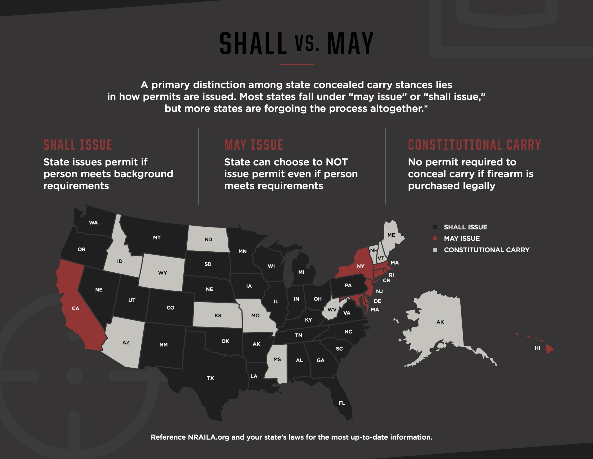
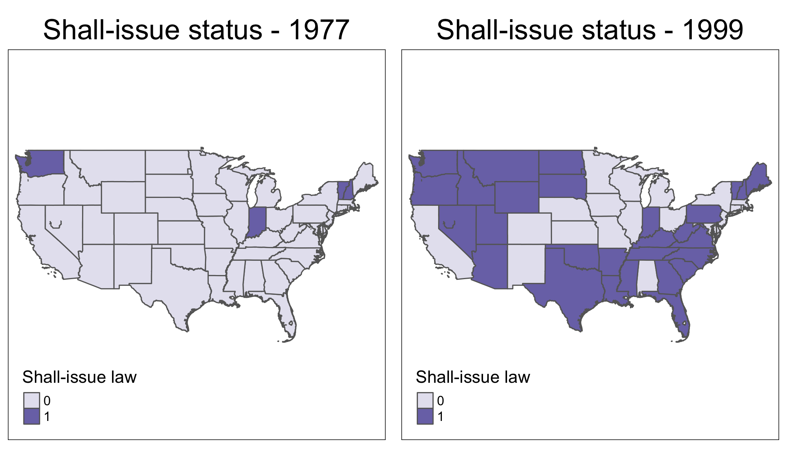
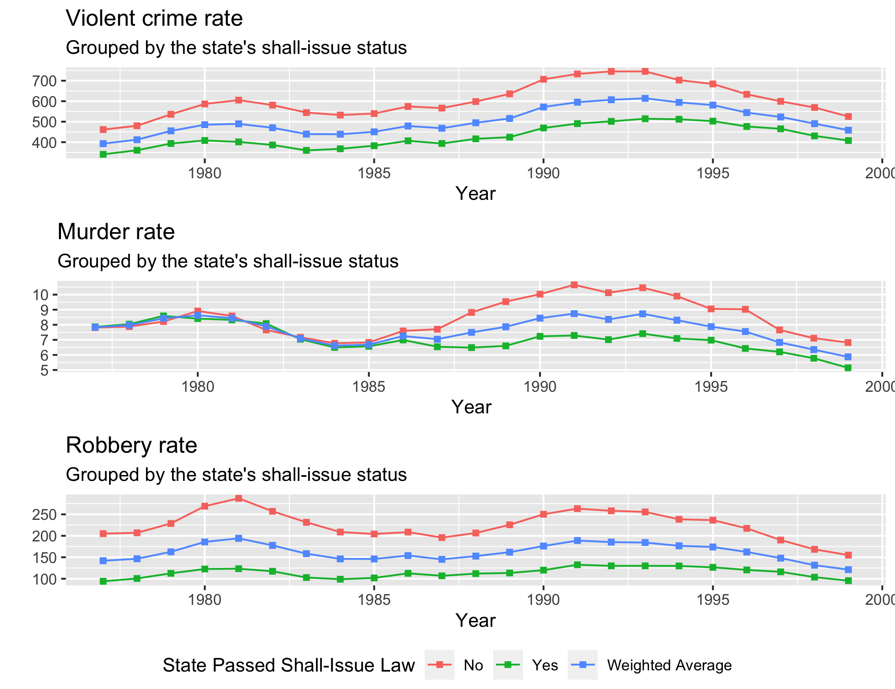
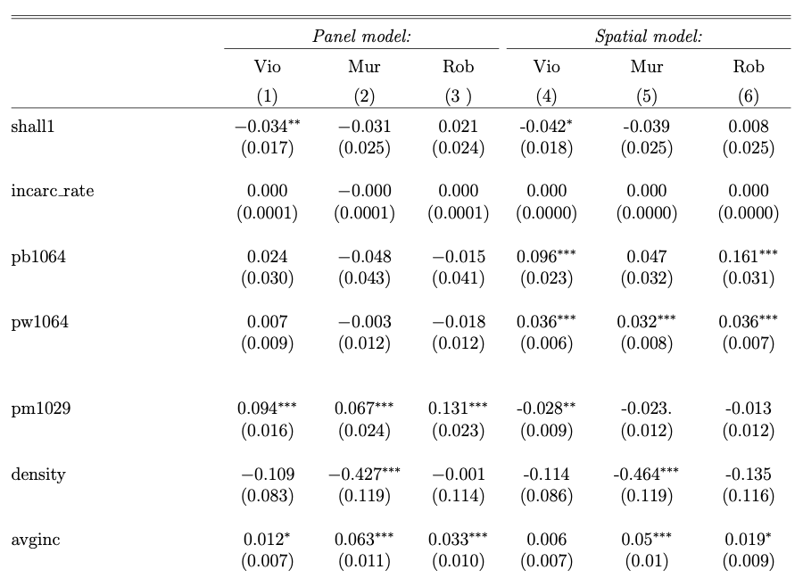
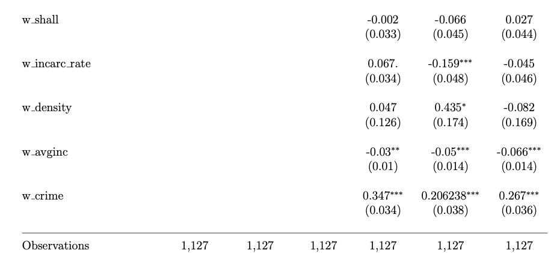

class: left

```{r xaringanExtra-freezeframe, echo=FALSE, message=F, warning=F}
xaringanExtra::use_freezeframe()
xaringanExtra::use_scribble()
library(here)
```

# Guns and violence in the U.S.

.center[
```{r, echo=F,  out.width="70%"}
knitr::include_graphics("figures/gunPercentage.png")
```
]

.footnote[
[1] Retrieved from [America's gun culture in charts](https://www.bbc.com/news/world-us-canada-41488081)
]


---

# Guns and violence in the U.S.

.center[
```{r, echo=F,  out.width="70%"}
knitr::include_graphics("figures/noFirearms.png")
```
]

.footnote[
[1] Retrieved from [America's gun culture in charts](https://www.bbc.com/news/world-us-canada-41488081)
]

---

class: left
# Literature: Lott & Mustard

.pull-left[

]

--

.pull-right[

]

???

John Lott & David Mustardp

---

background-image: url("https://media.giphy.com/media/1etWs6HIlQM3Q0CDbt/giphy.gif")
background-size: cover
background-position: 20% 10%

---

class: left
# Literature: Ayres & Donohue


???

Ian Ayres & John Donohue III

---

# Data

- Panel data on **crime rates** and passing of **shall-issue laws**.
- 50 states + 1 Washington D.C (1977-1999)

--

.center[

]

---
## Shall-issue

```{r, shall_evolution ,echo=F}

```


---
background-image: url("figures/map.png")
background-size: contain


---


.middle[
```{r, crime_series, echo=FALSE}

```
]
---

# Model selection

Ayres and Donohue

<br>

$$\log{crime} = shall\beta_1 +  X \beta_2 +  \lambda j + u$$
<br>

--

Spatial Durbin model

<br>

$$\log{crime} = \rho W\log{crime} + shall \phi_1 +  Wshall\phi_2 + X \beta + WX\theta +  \lambda j  + \epsilon$$

???

Elhorst (2010): Si el modelo MCO es rechazado en favor del spatial lag model, spatial error model o en favor de ambos modelos, entonces el modelo Durbin espacial debe ser estimado.


---

.middle[
```{r, results1, echo=FALSE}

```
]
---
### The spatially lagged results

.middle[
```{r, results2, echo=FALSE}

```
]

---

# Guns?
More guns more crime? more guns less crime? more more less more? less less more guns? guns?

<br>
--

.center[
# We don't know
]

And that is different than stating that more guns == less crime
